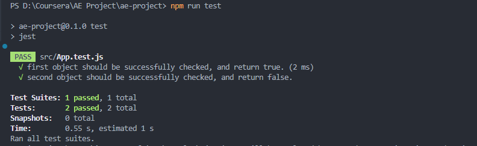

# SCENARIO GENERATOR

## Abstract project behavior:

My project is a system designed to manage and process scripts. The project is divided into several modules and components that provide the user with the following functions:

- Creating and editing scripts: The user can create new scripts, edit them and delete them using the application's graphical interface. Each script consists of a set of filters that are applied to JSON data.

- Adding and Managing Filters: To create scripts, the user can add filters by specifying a key, comparison operator, and value. Filters can be added, modified and deleted.

- Saving scripts: The user can save created scripts in a database or file. This allows scripts to be saved and reused.

- Loading scripts from the database: The user can load scripts from the database and also delete them if necessary.

- Applying filters to JSON data (Objects): Scripts can be applied to JSON data and the result will be an array of boolean values that reflect whether the data passed the filters successfully.

- Scenario testing: Ability to test scenarios on various objects and analyze the results. If all boolean values are true (in case isTested is set to true), then the script is considered successful.

- User Interface: The project provides a user interface with various forms and elements to interact with the application.

## Repository contents:

The repository contains the following files and folders:

- public: Folder with with index.html and manifest.json basic settings.

- src: Folder with the project's source code, divided into modules and components.
- - tests: Folder with unit tests to test the functionality of the application.
- - modules: Main folder with all components that are used in a project.
- - reducers: Folder with all slices (Redux Toolkit) that are used in a project. 
- - store: main slices storage, what keeps all data, that are proceed by RTK.
- README.md: The file you are reading now contains an overview of the project and instructions for installing and using it.
- package.json: File with dependencies and project settings for installation via npm.
- firebase.config.js: Configuration file for connecting to Firebase, used for storing data.

## Installation and use instructions:

Install the dependencies by running npm install in the project root folder.
Start the project using the npm start command.
Open the application in your web browser and start creating, editing and testing scripts.

## Technology stack:

During the project i used: React(as js framework), Tailwind(to make designing easier and better), Redux(for state managment), React Drag'n'drop library(https://react-dnd.github.io/react-dnd/about), React-select(https://react-select.com/home), Jest(for testing), Firebase Realtime Database(for data storing in database), Git/Github(as VCS - version control system), Node.js, webpack(as bundler), and a lot of other side-technologies, which comes in with create-react-app, such as babel, and a lot of others.

## How to contribute

1. If you find a bug or have a suggestion, create a new issue in the [Issues](https://github.com/dmitry-lapin/AE-Project/issues) section.

2. If you have specific changes, create a Pull Request. I am happy to accept any constructive suggestions.

3. For general discussions and questions, use the [Discussions](https://github.com/dmitry-lapin/AE-Project/discussions) section.

## 🚀 Roadmap for project improvement

I've done a great job on the current version of my project, and now it's time to focus on continually improving it. In this document, we will outline my plans and goals, and describe specific tasks that will help me move forward.

## 🔍 Looking to the future
Goal: Development of the project in a modern style and improvement of user experience.

### Tasks:
Design Update:

Study of modern trends in user interface design.
Design and implementation of updated designs for a more attractive appearance.
Performance optimization:
Identify code bottlenecks and optimize to improve performance.
Implementation of tools for monitoring and analyzing application performance.

Mobile adaptation:
Refactoring existing code for more mobile display.
Testing and finalizing the interface for various types of devices.

🚧 Technical debt and maintenance
Goal: Ensuring stable operation and supporting the latest technologies.

Tasks:
Update dependencies:
Periodically update third-party libraries and packages to use the latest versions.
Automate the dependency update process.
Code refactoring:

Analysis of the code base for outdated practices and bad patterns.
Conducted refactorings to improve readability and maintainability.
Safety:

Conducting security audits and implementing recommendations to protect against known threats.
Implementation of mechanisms to detect and prevent potential vulnerabilities.

## 🚀 New features and improvements
Goal: Expanding functionality and meeting user needs.

Tasks:
Functional additions:

Research user needs and identify possible functional improvements.
Introducing new features that improve the overall user experience.
Feedback from users:

Organizing the collection of feedback from users to identify problems and suggestions.
Regular updates of the project taking into account suggestions and feedback.
Documentation:

Expansion of documentation to simplify the introduction of new participants into the project.
Maintaining up-to-date documentation on the current version and changes.

# Testing

I was tasked with testing a section of my application. To implement this task, I decided to use the Jest framework.

Thanks for your input!